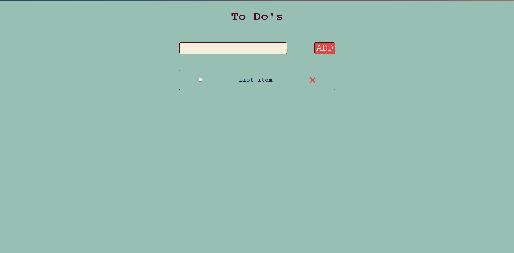
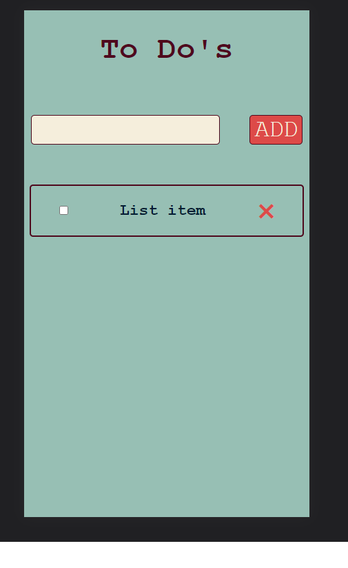

# ToDo App

> A ToDo app for creating and deleting list items.

## Built With

- HTML
- CSS
- JavaScript

## Live Demo

[Live Demo Link](https://johndmurphy.github.io/to-do-app/)

👤 **Author**

- GitHub: [@johnDMurphy](https://github.com/JohnDMurphy)

## 🤝 Contributing

Contributions, issues, and feature requests are welcome!

Feel free to check the [issues page](https://github.com/issues).

## Show your support

Give a ⭐️ if you like this project!

## 📝 License

This project is [MIT](MIT.md) licensed.
